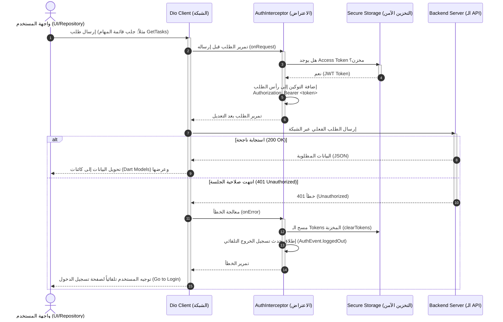

# دليل مناقشة مشروع TaskFlow 🚀
## (TaskFlow Project Defense & Discussion Guide)

تم إعداد هذا المستند لمساعدتك في شرح معمارية وهيكلية تطبيق **TaskFlow** بالتفصيل أثناء مناقشة المشروع. يغطي هذا الدليل الطبقات الأساسية (Core Layers)، والميزات (Features)، والربط التفصيلي بين الشبكة (API) والتخزين (Storage).

---

## 📌 أولاً: الهيكل المعماري العام (Architectural Overview)
يعتمد تطبيق **TaskFlow** على نمط **Clean Architecture** مع تقسيم المجلدات بناءً على الميزات (**Feature-First Approach**). هذا التصميم يضمن:
1. **سهولة الصيانة (Maintainability):** عزل أجزاء التطبيق المختلفة عن بعضها.
2. **قابلية التوسع (Scalability):** إمكانية إضافة ميزات جديدة بسهولة دون التأثير على الكود الحالي.
3. **التشغيل المعزول وقابلية الاختبار (Testability):** تسهيل كتابة اختبارات أحادية (Unit Tests) لكل جزء.

التطبيق مقسم إلى مجلدين رئيسيين تحت `lib`:
* **`core`:** يحتوي على الأدوات والإعدادات المشتركة بين كل الميزات (مثل الشبكة، التوجيه، التخزين، إلخ).
* **`features`:** يحتوي على الميزات الفردية للتطبيق (مثل Auth, Tasks, Projects) وكل ميزة تنقسم داخلياً إلى طبقاتها الخاصة (Data, Domain, Presentation).

---

## 🛠️ ثانياً: شرح الطبقات الأساسية (Core Layers)

### 1. Routes (التوجيه والتنقل)
* **المكتبة المستخدمة:** `GoRouter` (الموصى بها رسمياً من فريق Flutter).
* **الملف الأساسي:** `lib/core/routes/app_router.dart`
* **الفكرة وطريقة العمل:**
  * يتم تعريف جميع شاشات التطبيق كمسارات (`GoRoute`) داخل قائمة مركزية.
  * يسهل هذا الأسلوب التحكم في التنقل (Navigation) ومنع الأخطاء الناتجة عن الطرق التقليدية.
  * **تمرير البيانات (Passing Arguments):** يتم استخدام الـ `state.extra` لتمرير البيانات المعقدة بين الشاشات بأمان (مثل تمرير الـ `projectId` أو كائن المهمة المراد تعديلها `taskToEdit` لشاشة تعديل المهام).
  * **شاشات التطبيق المعرفة:** تبدأ بـ `/onboarding` كمسار بدئي، تليها شاشات `/login` و `/signup` و `/welcome` والواجهة الرئيسية الهيكلية `/home` (`AppShell`)، بالإضافة إلى شاشات تفاصيل المهام والمشاريع ولوحة تحكم المدير (`/admin`).

---

### 2. Storage (التخزين المحلي الآمن)
* **المكتبة المستخدمة:** `FlutterSecureStorage`.
* **الملف الأساسي:** `lib/core/storage/secure_storage.dart`
* **الفكرة وطريقة العمل:**
  * لا يتم استخدام التخزين العادي (مثل SharedPreferences) للبيانات الحساسة، بل يتم استخدام التخزين المشفر المعتمد على **KeyChain** في iOS و **Keystore** في Android.
  * يوفر كلاس `SecureStorage` كـ `lazySingleton` (نسخة واحدة يتم إنشاؤها عند الطلب فقط لترشيد استهلاك الذاكرة).
  * **المفاتيح (Keys) والبيانات المخزنة:**
    * `access_token` و `refresh_token`: للتحقق من هوية المستخدم وتفويض العمليات.
    * `user_data`: بيانات المستخدم الأساسية المخزنة كـ JSON مُرمّز (UserDto).
    * `onboarding_seen`: قيمة منطقية (Boolean على شكل String) لحفظ ما إذا كان المستخدم قد شاهد شاشات التقديم لتخطيها مستقبلاً.

---

### 3. Network (الشبكة والاتصال بالـ API)
* **المكتبة المستخدمة:** `Dio` (تتميز بمرونة هائلة ودعم الـ Interceptors مقارنة بـ Http العادية).
* **الملف الأساسي:** `lib/core/network/dio_client.dart`
* **الفكرة وطريقة العمل:**
  * كلاس `DioClient` مسؤول عن تهيئة وإعداد كائن الـ `Dio` بخصائص معيارية:
    * `baseUrl`: الرابط الأساسي للسيرفر.
    * `connectTimeout`: حد أقصى للاتصال بالشبكة (15 ثانية).
    * `receiveTimeout`: حد أقصى لاستلام استجابة السيرفر (20 ثانية).
    * `Headers`: إعداد رأس الطلبات الافتراضي ليقبل صيغة JSON (`Accept: application/json`).
  * **الاعتراض المحسن للطلبات (Interceptors):** يتم تسجيل مفسرات واعتراضات على الطلبات:
    1. **`AuthInterceptor`:** لإدراج الـ Token تلقائياً في رأس كل طلب وحل مشكلة انتهاء الجلسة.
    2. **`ErrorInterceptor` / `ErrorMapper`:** لمعالجة الأخطاء القادمة من السيرفر.
    3. **`PrettyDioLogger`:** لطباعة تفاصيل الطلبات والاستجابات بشكل منسق وسهل القراءة خلال مرحلة التطوير (Development Logs).

---

### 4. Error (إدارة ومعالجة الأخطاء)
* **الملفات الأساسية:** `lib/core/error/failure.dart` و `lib/core/error/error_mapper.dart`
* **الفكرة وطريقة العمل:**
  * يعتمد التطبيق على مفهوم الـ **Failures** بدلاً من رمي الاستثناءات (Exceptions) العشوائية التي قد تتسبب في انهيار التطبيق (Crash).
  * لدينا أنواع مخصصة من الفشل:
    * `ServerFailure`: لفشل السيرفر أو الأخطاء الراجعة منه (مثل خطأ 500 أو 400).
    * `NetworkFailure`: في حال انقطاع الإنترنت أو انتهاء وقت الاتصال (Timeout).
  * **مُحوّل الأخطاء (`ErrorMapper`):**
    * يقوم بفحص `DioException`.
    * إذا كان السيرفر قد أرجع خطأ منظم بصيغة JSON (يحتوي على حقول مثل `succeeded`, `message`, `errors`)، يقوم الـ Mapper بقراءتها وعرضها للمستخدم بلغة مفهومة.
    * إذا كان الخطأ متعلقاً بالاتصال أو جدار الحماية، يرجّع `NetworkFailure` أو رسالة خطأ مناسبة بدلاً من كود برمجي غير مفهوم.

---

### 5. Config (الإعدادات العامة للتطبيق)
* **الملف الأساسي:** `lib/core/config/app_config.dart`
* **الفكرة وطريقة العمل:**
  * يتيح عزل متغيرات التهيئة الخاصة بالتطبيق عن منطق العمل (Business Logic).
  * يحتوي على إعدادين رئيسيين: `baseUrl` الخاص بالـ API (المستضاف حالياً على `https://task-flowapi.runasp.net`) والـ `enableLogs` لتشغيل/إيقاف طباعة تفاصيل الشبكة.
  * يتيح التطبيق بيئتين للعمل عبر فواتير التصنيع (Factory Constructors): `AppConfig.dev()` للتطوير و `AppConfig.prod()` للإنتاج.

---

## 👥 ثالثاً: شرح الميزات الرئيسية (Features)

### 1. Auth (نظام المصادقة والتسجيل)
* **المسار:** `lib/features/auth`
* **طريقة العمل:**
  * تحتوي على صفحات التسجيل (`SignupPage`) وتسجيل الدخول (`LoginPage`).
  * يتم إرسال بيانات المستخدم (البريد الإلكتروني وكلمة المرور) إلى الـ API عبر طلب `POST`.
  * عند نجاح العملية، يرجع السيرفر كود النجاح ومعه الـ JWT Tokens وبيانات المستخدم.
  * يتم تمرير الـ Tokens إلى `SecureStorage` لحفظها، وتحديث حالة التطبيق لينتقل المستخدم فوراً إلى الشاشة الرئيسية (`AppShell`).

### 2. Onboarding (التهيئة والترحيب)
* **المسار:** `lib/features/onboarding`
* **طريقة العمل:**
  * شاشات تقديمية تشرح فكرة التطبيق للمستخدم الجديد وتزيد من جاذبية تجربة المستخدم (UI/UX).
  * عند انتهاء المستخدم من تصفح شاشات الـ Onboarding وضغطه على زر البدء، يتم استدعاء `setOnboardingSeen()` في `SecureStorage` لحفظ القيمة `true`.
  * في المرات القادمة لفتح التطبيق، يتم التحقق من هذا المفتاح؛ فإذا كان `true` يتم تحويل المستخدم مباشرة إلى شاشة تسجيل الدخول أو الشاشة الرئيسية دون عرض شاشات التهيئة مرة أخرى.

---

## 🔄 رابعاً: شرح تفصيلي وعميق للربط بين الـ API والتخزين (API & Storage Integration)

هذا هو الجزء الأهم في مناقشة المشروع! كيف يتعاون نظام الشبكة (Dio/API) ونظام التخزين المشفر (SecureStorage) معاً لإدارة جلسة المستخدم وتأمين البيانات؟

### 1. المخطط التدفقي لرحلة الطلب الشبكي (Request Lifecycle)

يوضح المخطط التالي كيف يتحرك الطلب من واجهة المستخدم وحتى استرجاع البيانات من السيرفر مع فحص الـ Tokens:



---

### 2. شرح آليات الربط البرمجية (How it works under the hood)

#### أ. حقن التوكين التلقائي (Dynamic Token Injection)
في كل مرة يتم إرسال طلب فيها إلى السيرفر، لا يقوم المبرمج بكتابة الـ Token يدوياً. بدلاً من ذلك، يقوم الـ `AuthInterceptor` بالوظيفة كالتالي:
```dart
@override
Future<void> onRequest(RequestOptions options, RequestInterceptorHandler handler) async {
  // 1. جلب التوكين من التخزين الآمن
  final token = await storage.readAccessToken();
  // 2. إذا كان متوفراً، يتم حقنه في الهيدر الخاص بالطلب
  if (token != null) {
    options.headers['Authorization'] = 'Bearer $token';
  }
  // 3. تمرير الطلب لمتابعة مساره نحو السيرفر
  handler.next(options);
}
```

#### ب. التعامل التلقائي مع انتهاء الجلسة (401 Unauthorized Handling)
إذا انتهت صلاحية الـ JWT Token المخزن في جهاز المستخدم، سيرفض السيرفر الطلب ويرد برمز الحالة `401`. يقوم الـ `AuthInterceptor` بإنقاذ الموقف ومنع التطبيق من التصرف بشكل عشوائي:
1. يتم اعتراض الخطأ في دالة `onError`.
2. يتم مسح التوكينات التالفة من الـ `SecureStorage` لضمان ألا يحاول التطبيق استخدامها مجدداً.
3. يتم إرسال حدث عبر الـ `AuthEventBus` يفيد بتسجيل الخروج.
4. تستمع واجهات المستخدم أو الـ Router لهذا الحدث وتقوم بنقل المستخدم فوراً لصفحة تسجيل الدخول لطلب إعادة المصادقة بشكل آمن وراقٍ.

```dart
@override
Future<void> onError(DioException err, ErrorInterceptorHandler handler) async {
  if (err.response?.statusCode == 401) {
    await storage.clearTokens(); // مسح البيانات التالفة
    bus.emit(AuthEvent.loggedOut); // إشعار التطبيق لتغيير الشاشة
  }
  handler.next(err);
}
```

---

### 💡 نصائح ذهبية لتقديم هذا الجزء أمام لجنة المناقشة:
1. **ابدأ بالهيكل:** وضح للجنة أنك تفصل منطق العمل (Business Logic) تماماً عن الواجهات، وأنك تستخدم **Dependency Injection (مثل injectable / get_it)** لتوزيع وإدارة كائنات مثل الـ `Dio` والـ `SecureStorage` في كامل التطبيق بكفاءة وبأقل استهلاك للذاكرة.
2. **برر اختياراتك:** عندما يسألونك "لماذا استخدمت FlutterSecureStorage وليس SharedPreferences؟" أجب فوراً بأن **SharedPreferences يخزن البيانات كملفات نصية بسيطة وسهلة الاختراق (Plain Text)** على جهاز المستخدم، بينما **SecureStorage يقوم بتشفير البيانات برمجياً عبر عتاد الجهاز المخصص للحماية (Keystore/Keychain)** مما يجعله الخيار الوحيد الصحيح لحفظ توكينات الـ API.
3. **أبرز قوة معالجة الأخطاء:** وضح لهم أن الـ `ErrorMapper` يضمن عدم ظهور شاشات حمراء أو انهيارات للمستخدم، بل يحول كافة المشاكل الشبكية والسيرفرية إلى رسائل لطيفة ومفهومة يسهل قراءتها والتعامل معها.

---
 بالتوفيق والنجاح في المناقشة! مشروعك مبني بأسس برمجية احترافية تحاكي الشركات الكبرى.
